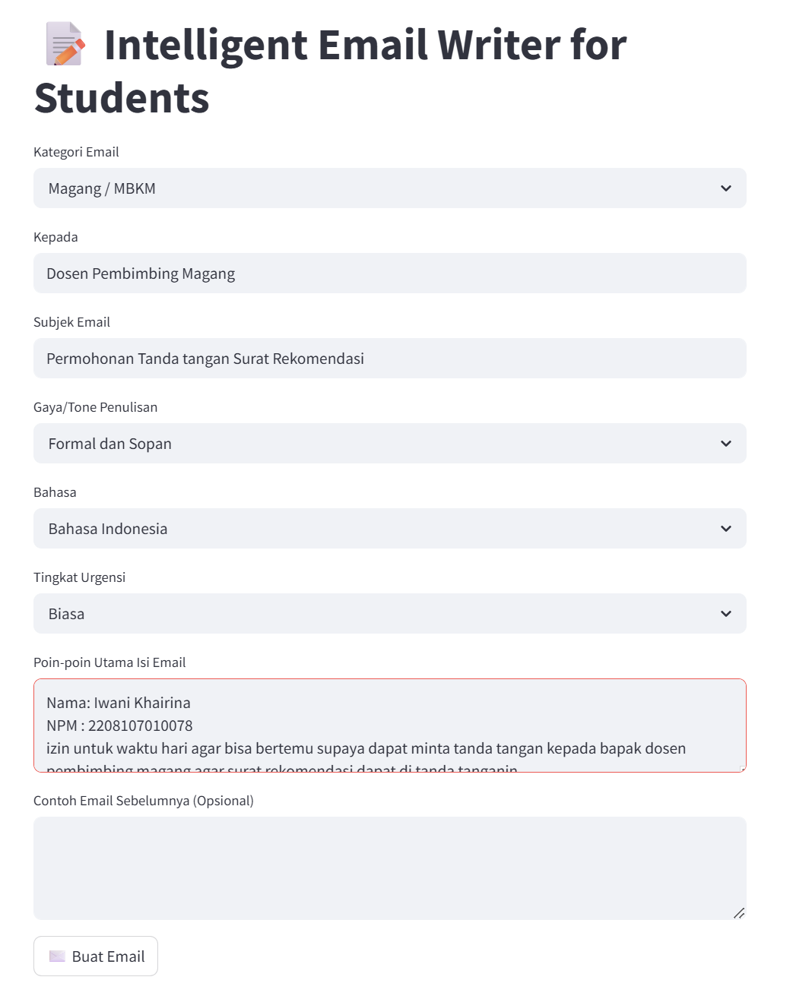

# 📝 Intelligent Email Writer for Students

**Iwani Khairina**  (2208107010078)

Proyek ini merupakan aplikasi web yang dirancang untuk membantu mahasiswa dalam menyusun email secara otomatis dan profesional, dengan memanfaatkan teknologi Large Language Model (LLM) melalui Gemini API.

---

## 📦 Fitur Utama

1.Menyediakan pilihan kategori email seperti: Akademik, Skripsi, Magang, dan lainnya.

2.Menentukan gaya bahasa: formal, netral, atau santai.

3.Mendukung penulisan dalam Bahasa Indonesia dan Inggris.

4.Pengguna dapat mengisi poin-poin penting yang ingin disampaikan.

5.Menghasilkan email yang ringkas, jelas, dan profesional secara otomatis.

---

## 📁 Struktur Proyek

```
intelligent_email_writer/
├── .env                   # Menyimpan kunci API Gemini
├── app.py                 # Antarmuka pengguna menggunakan Streamlit
├── backend/
│   └── main.py            # API backend berbasis FastAPI
└── requirements.txt       # Daftar dependensi Python
````

---

## ⚙️ Instalasi dan Menjalankan Proyek

### 1. Kloning repository

```bash
git clone 
cd UAS-Praktikum-Pembelajaran-Mesin
````

### 2. Menyiapkan dan Menjalankan Backend (FastAPI)
```bash
# Membuat virtual environment
python3.10 -m venv env

# Aktifkan environment
source env/bin/activate   # Untuk Linux/macOS
env\Scripts\activate      # Untuk Windows

# Instalasi dependensi
pip install -r requirements.txt

# Menjalankan server FastAPI
uvicorn backend.main:app --reload --host 0.0.0.0 --port 8000
```

### 3. Setup dan jalankan Frontend (Streamlit)

Buka terminal baru:

```bash
# Pastikan sudah berada di direktori project
streamlit run app.py
```

---

## 🔐 Konfigurasi API Key Gemini

1. Buka [https://aistudio.google.com/app/apikey](https://aistudio.google.com/app/apikey)
2. Klik **Create API Key**.
3. Copy API key dan simpan ke dalam file `.env` di root project dengan format:

```env
GEMINI_API_KEY=your_api_key_here
```

---

## 📬 Contoh Penggunaan

1. Pilih kategori dan gaya penulisan email.
2. Masukkan informasi penerima, subjek, dan poin-poin penting.
3. Klik tombol **"Buat Email"**.
4. Email hasil generate akan ditampilkan di halaman aplikasi.

## 📋 Hasil dan Tampilan Frontend

 <br>
